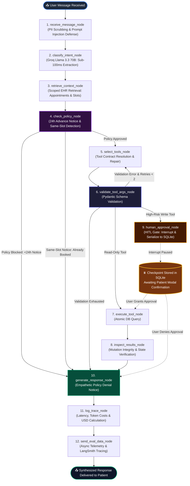
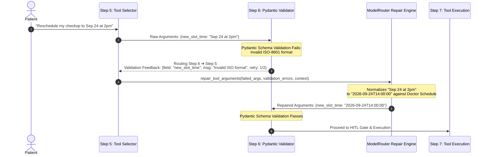
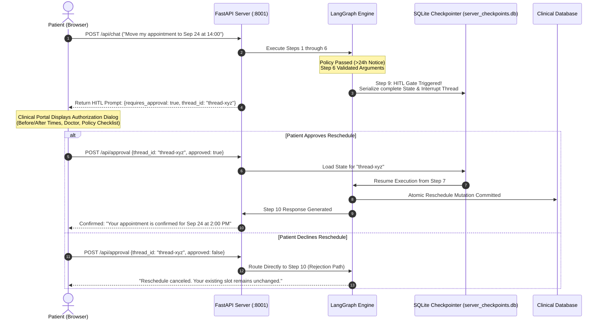
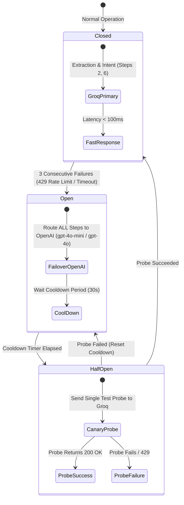
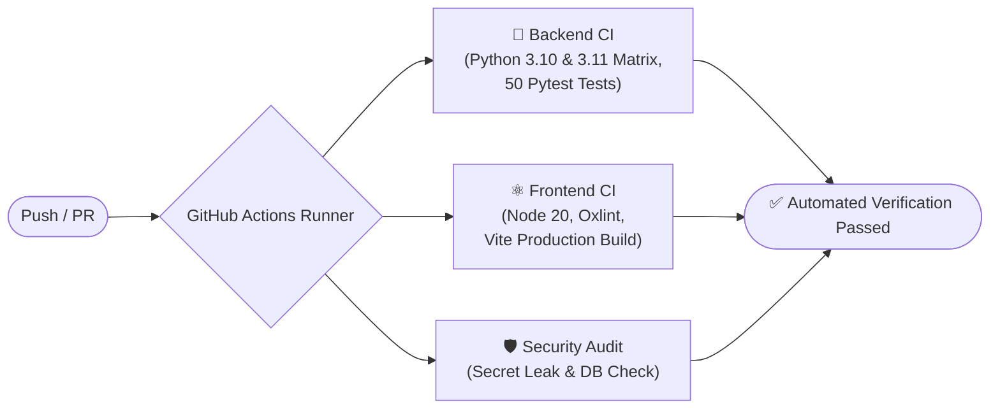

# NovaHealth AI Clinical Portal & LangGraph 12-Step Agent System

[](https://www.python.org/)
[](https://github.com/langchain-ai/langgraph)
[](https://fastapi.tiangolo.com/)
[](https://react.dev/)
[](https://vitejs.dev/)
[]()
[](https://github.com/adithyaboyapati/Agentic_Scheduling_System/actions/workflows/ci.yml)
[](https://opensource.org/licenses/MIT)

> A production-grade, multi-tenant Agentic AI System implementing a strict **12-Step Execution Control Loop** compiled as a LangGraph `StateGraph`, paired with an interactive clinical portal frontend. Built for automated healthcare appointment rescheduling subject to doctor availability, same-slot detection, and deterministic 24-hour advance cancellation policies.

---

## 📑 Table of Contents

- [Why NovaHealth?](#-why-novahealth)
- [System Architecture](#-system-architecture)
- [The 12-Step Execution Control Loop](#-the-12-step-execution-control-loop)
- [Dynamic Feedback Self-Correction Loop](#-dynamic-feedback-self-correction-loop)
- [Human-in-the-Loop (HITL) Gate](#-human-in-the-loop-hitl-gate)
- [Dual-Provider Router & Circuit Breaker](#-dual-provider-router--circuit-breaker)
- [Clinical Web Portal Features](#-clinical-web-portal-features)
- [Repository Structure](#-repository-structure)
- [Getting Started](#-getting-started)
- [Running Automated Tests](#-running-automated-tests)
- [CI/CD Pipeline & Docker Deployment](#-cicd-pipeline--docker-deployment)
- [API Reference](#-api-reference)
- [License](#-license)

---

## 🏥 Why NovaHealth?

Healthcare scheduling cannot rely on naive, unconstrained LLM tool-calling. Uncontrolled models risk:
1. **Clinical Policy Violations**: Canceling appointments within the 24-hour non-refundable boundary without front-desk authorization.
2. **Hallucinated Slots & Double Booking**: Committing doctor bookings to slots outside official operating hours or doctor schedules.
3. **Data Security Failures**: Leaking protected health information (PHI/PII) or succumbing to prompt injections that bypass appointment rules.
4. **Fragile Input Formats**: Crashing when users provide natural language dates (`"next Tuesday at 2pm"`) rather than strict ISO-8601 strings.

**NovaHealth** solves this with a **deterministic, auditable 12-step state machine**:
- **Zero Hallucinated Writes**: Read-only actions run seamlessly; high-risk database mutations are quarantined behind a persistent **Human-in-the-Loop (HITL) Gate**.
- **Deterministic Rules Engine**: Python-level policy checks intercept `<24h` cancellations and redundant same-slot requests before LLM reasoning or database mutation.
- **Pydantic Validation with Self-Correction**: When schema validation fails, a closed feedback loop routes the error back to the model to repair arguments (bounded to 2 retries).
- **Dual-Model Performance**: Sub-100ms structured intent extraction powered by Groq (`llama-3.3-70b-versatile`), paired with clinical reasoning and patient communication via OpenAI (`gpt-4o`), with automatic circuit-breaker failover.

---

## 🏗️ System Architecture

The project is architectured as a decoupled, full-stack reactive system:

```mermaid
flowchart TB
    subgraph Client ["🖥️ Clinical Web Portal (React 19 + Vite 8)"]
        direction TB
        UI_Header["Patient Switcher (Alice Walker P101 / Bob Miller P102)"]
        UI_Chat["Real-Time Chat & Clickable Slot Pills"]
        UI_EHR["Hero Appointment Card & Day Filter Dock"]
        UI_Inspector["12-Step Execution Visualizer & Telemetry"]
        UI_HITL["HITL Authorization Dialog Modal"]
    end

    subgraph Server ["⚡ Backend Server (FastAPI on :8001)"]
        direction TB
        API_Chat["POST /api/chat & /api/chat/stream"]
        API_Approval["POST /api/approval & /api/approval/stream"]
        API_EHR["GET /api/ehr & GET /api/metrics"]
        SSE_Engine["Server-Sent Events (SSE) Stream Handler"]
    end

    subgraph StateGraph ["🔄 LangGraph 12-Step Control Loop"]
        direction TB
        Guardrails["1. Security Guardrails & PII Scrubber"]
        Router["2. Groq Intent Classifier (<100ms)"]
        Context["3. Minimal RAG Context Retriever"]
        Policy["4. 24h Notice & Same-Slot Policy Engine"]
        ToolSelect["5. Tool Selector & Schema Repair Engine"]
        Validator["6. Pydantic Argument Validator"]
        ToolExec["7. Database Mutation (Atomic Lock)"]
        Inspector["8. Result Integrity Inspector"]
        HITLGate["9. HITL Intercept Checkpoint Gate"]
        Synthesizer["10. OpenAI Clinical Response Generator"]
        Tracer["11. Trajectory Tracer & Cost Computer"]
        EvalWorker["12. Async Evaluator & LangSmith Exporter"]
    end

    subgraph Persistence ["💾 Persistence & Storage Layer"]
        Checkpointer[("SQLite Checkpoint Storage (server_checkpoints.db)")]
        ClinicDB[("Mock Healthcare DB (Thread-Safe In-Memory Singleton)")]
    end

    %% Client to Server
    UI_Chat -->|SSE Streaming Request| API_Chat
    UI_HITL -->|Authorization Decision| API_Approval
    UI_EHR -->|State Polling & Instant Reschedule| API_EHR

    %% Server to StateGraph
    API_Chat --> StateGraph
    API_Approval --> StateGraph
    StateGraph --> SSE_Engine
    SSE_Engine -.->|Live Node Progression| UI_Inspector

    %% StateGraph to Persistence
    Validator --> ToolExec
    Validator -.->|High-Risk Mutation| HITLGate
    HITLGate <-->|Pause & Resume State| Checkpointer
    ToolExec <-->|Atomic Mutation| ClinicDB
    Context <-->|Scoped Retrieval| ClinicDB
```



---

## 🔄 The 12-Step Execution Control Loop

Every incoming interaction travels through an explicit, step-by-step state machine:



### 12-Step Execution Control Loop Specification

| Step # | Node Name | Component | Functionality & Guarantees |
|:---:|:---|:---|:---|
| **1** | `receive_message_node` | `SecurityGuardrails` | Sanitizes input, scrubs PII (SSN, phone, email, MRN), and blocks adversarial prompt injections before LLM invocation. |
| **2** | `classify_intent_node` | `ModelRouter` (Groq) | Sub-100ms structured intent classification (`RESCHEDULE`, `CANCEL`, `INQUIRE`, `AUDIT`) via `llama-3.3-70b-versatile`. |
| **3** | `retrieve_context_node` | `ContextRetriever` | Scoped EHR retrieval (active patient record, current appointment, doctor availability) without whole-database dumping. |
| **4** | `check_policy_node` | `PolicyEngine` (OpenAI) | Enforces the strict **24-hour advance cancellation rule**, intercepts **redundant same-slot requests (`POLICY_SAME_SLOT`)**, and validates patient authorization. |
| **5** | `select_tools_node` | Tool Selector & Repair | Resolves tool schemas (`GetAppointmentDetails`, `GetAvailableSlots`, `RequestSlotReschedule`). Operates the **Dynamic Feedback Repair Engine** on Pydantic errors. |
| **6** | `validate_tool_args_node` | Pydantic Schemas | Validates ISO timestamps, IDs, and date filters with granular error diagnostics. Emits structured diagnostics on failure, triggering Step 5 repair loop (up to 2 retries). |
| **7** | `execute_tool_node` | `BaseHealthcareTool` | Performs atomic, thread-safe database mutations with execution timeouts and lock safety. |
| **8** | `inspect_results_node` | Integrity Checker | Verifies mutation success, double-booking prevention, and state consistency. |
| **9** | `human_approval_node` | `SqliteSaver` Checkpoint | **Human-in-the-Loop (HITL) Gate**. Pauses graph execution for high-risk write operations, serializes state to SQLite, and awaits explicit user authorization. |
| **10** | `generate_response_node` | `ModelRouter` (OpenAI) | Generates empathetic, structured, and clinically precise communication using `gpt-4o` (or deterministic synthesis on policy notices). |
| **11** | `log_trace_node` | `TrajectoryTracer` | Records granular spans: provider, model, tokens, time-to-first-token, duration, and cost in USD. |
| **12** | `send_eval_data_node` | `AsyncEvaluationWorker` | Asynchronously computes policy compliance, task success, self-correction recovery rate, and exports traces to LangSmith. |

---

## 🔁 Dynamic Feedback Self-Correction Loop

When a user provides ambiguous or improperly formatted arguments (e.g., `"reschedule to 09-24 2pm"` or missing appointment prefixes), the agent self-corrects without crashing:



- **Structured Diagnostic Payload**: Captures `field`, `input`, `msg`, and `type` from `ValidationError.errors()`.
- **Bounded Retries**: Strictly capped at `MAX_RETRIES = 2`. If invalid input persists, the agent exits cleanly to Step 10 and asks the patient for clarification.
- **Observability**: Every self-correction event records recovery status and updates the live `self_correction_recovery_rate` metric in the UI.

---

## 🛡️ Human-in-the-Loop (HITL) Gate

High-risk database mutations (rescheduling or canceling appointments) are **quarantined**:



---

## ⚡ Dual-Provider Router & Circuit Breaker

The system optimizes for both **speed** and **clinical safety** using a dual-LLM topology backed by an automated circuit breaker:



| Role | Primary Provider & Model | Latency | Fallback Model |
|:---|:---|:---:|:---|
| **Fast Extraction** (Steps 2 & 6) | Groq `llama-3.3-70b-versatile` | **< 100ms** | OpenAI `gpt-4o-mini` |
| **Reasoning & Synthesis** (Steps 4 & 10) | OpenAI `gpt-4o` | ~1200ms | OpenAI `gpt-4o-mini` |
| **Policy Enforcement** (Step 4) | Deterministic Python Rules Engine | **< 1ms** | Direct bypass |

---

## 💻 Clinical Web Portal Features

The frontend is a custom-engineered clinical operations dashboard built with React 19, Vite, and Vanilla CSS:

- **Multi-Tenant Profile Isolation**: Instantly toggle between **Alice Walker (`P101`)** (Cardiology, reschedule eligible) and **Bob Miller (`P102`)** (Dermatology, `<24h` policy violation demo). State trees are isolated per patient ID.
- **Hero Appointment Card**: Relative notice indicators (*"In 6 days"*, *"⚠️ In 6 hours"*), clinic room coordinates, and expandable **Visit Prep Notes**.
- **Interactive Calendar & Instant Dock**: Day filter bar (`All Days`, `Tue Sep 22`, `Wed Sep 23`, `Thu Sep 24`, `Fri Sep 25`) with a **Floating Reschedule Dock** supporting 1-click booking (`⚡ Instant Reschedule ➔`).
- **In-Chat Clickable Slot Badges**: Assistant suggestions are parsed into clickable badges (`🕒 2026-09-24 14:00:00 ➔`) for instant one-tap rescheduling.
- **Segmented Control Dashboard**:
  - **Appointments & Open Slots**: Real-time EHR slot inventory.
  - **12-Step Loop & Telemetry**: Live interactive step visualizer with `🔄 Loop` badge and millisecond duration spans.
  - **EHR Audit Trail Ledger**: Real-time immutable record of clinic mutations.
- **Server-Sent Events (SSE) Streaming**: Real-time visualization of node progression as the agent traverses the graph.
- **Web Audio Feedback & Toasts**: Synthesized chimes for success, clicks, and HITL authorization warnings (with mute toggle).

---

## 📁 Repository Structure

```text
.
├── README.md                      # Comprehensive project documentation
├── requirements.txt               # Root Python dependencies
├── .env.example                   # Environment variables template
├── .gitignore                     # Watertight secret & checkpoint exclusions
├── agent_system/                  # Python LangGraph backend package
│   ├── server.py                  # FastAPI server with REST & SSE streaming endpoints (port 8001)
│   ├── main.py                    # Standalone CLI demo runner (5 clinical scenarios)
│   ├── requirements.txt           # Package dependencies
│   ├── .env.example               # Local environment template
│   ├── src/
│   │   ├── orchestrator/          # LangGraph core workflow engine
│   │   │   ├── graph.py           # StateGraph assembly & SqliteSaver persistence
│   │   │   ├── nodes.py           # Implementation of all 12 execution nodes
│   │   │   ├── edges.py           # Dynamic routing, policy gates & self-correction retry
│   │   │   └── state.py           # TypedDict state schema with self-correction history
│   │   ├── models/                # Dual LLM router, repair engine & circuit breaker
│   │   │   ├── router.py          # Groq + OpenAI routing, date normalization & repair engine
│   │   │   ├── circuit_breaker.py # Circuit breaker state machine (Closed, Open, Half-Open)
│   │   │   ├── response_generator.py # Clinical response synthesis
│   │   │   ├── nlp_utils.py       # Timestamp & date normalization helpers
│   │   │   └── schemas.py         # Pydantic validation schemas & metrics models
│   │   ├── policies/              # Deterministic clinical rules
│   │   │   ├── engine.py          # 24h advance notice & same-slot interceptor
│   │   │   ├── cancellation_policy.py # Precise 24h boundary calculation
│   │   │   └── authorization.py   # Multi-tenant ID access verification
│   │   ├── security/              # Security and guardrail engine
│   │   │   └── guardrails.py      # Unified PII anonymizer & prompt injection detector
│   │   ├── tools/                 # Tool implementations & mock database
│   │   │   ├── base.py            # BaseHealthcareTool contract with structured diagnostics
│   │   │   ├── appointment_tools.py # GetDetails, GetSlots, RequestReschedule
│   │   │   └── mock_db.py         # Thread-safe in-memory singleton EHR database
│   │   ├── evals/                 # Telemetry & evaluation framework
│   │   │   ├── tracer.py          # Span tracer & dynamic USD cost calculation
│   │   │   └── worker.py          # Async evaluation worker (recovery rate, compliance)
│   │   └── storage/               # Memory retrievers
│   │       ├── memory.py          # Minimal RAG context retriever
│   │       └── state.py           # Checkpoint state definitions
│   └── tests/                     # Test suite (50 passing tests)
│       ├── test_edge_cases.py     # 12 production edge cases (security, failover, race conditions)
│       ├── test_guardrails.py     # PII & injection tests
│       ├── test_policies.py       # 24h rule, authorization, same-slot tests
│       ├── test_router_circuit.py # Dual-provider & circuit breaker tests
│       ├── test_self_correction.py# Pydantic dynamic feedback loop tests
│       ├── test_state_graph.py    # End-to-end 12-step flow tests
│       ├── test_streaming.py      # SSE streaming & thread persistence tests
│       └── test_tools.py          # Tool schema & execution tests
└── frontend/                      # React 19 + Vite 8 clinical web portal
    ├── package.json
    ├── vite.config.js             # Dev server & port 8001 API proxy
    ├── index.html
    └── src/
        ├── App.jsx                # Multi-tenant state management & application shell
        ├── index.css              # Cyber-clean clinical dark mode styling & tokens
        ├── components/
        │   ├── Header.jsx         # Patient switcher, sound toggle, DB reset
        │   ├── ChatPanel.jsx      # Chat stream, quick actions, clickable in-message slots
        │   ├── EHRBoard.jsx       # Hero appointment card, day filters, instant slot dock
        │   ├── PipelineVisualizer.jsx # 12-step visualizer & telemetry inspector
        │   ├── HITLModal.jsx      # Authorization dialog modal
        │   └── Toast.jsx          # Notification toast stack
        └── utils/
            └── audio.js           # Web Audio API chime synthesizer
```

---

## 🚀 Getting Started

### Prerequisites
- **Python**: 3.10 or newer
- **Node.js**: 18.0 or newer (with `npm`)
- API Keys:
  - `OPENAI_API_KEY` (Required for Policy Reasoning & Response Generation)
  - `GROQ_API_KEY` (Optional for Sub-100ms Intent Extraction; automatically falls back to OpenAI if omitted)
  - `LANGCHAIN_API_KEY` (Optional for LangSmith observability)

---

### 1. Clone & Configure Environment

```bash
git clone https://github.com/adithyaboyapati/Agentic_Scheduling_System.git
cd Agentic_Scheduling_System

# Create .env from template
cp .env.example .env
```

Edit `.env` with your API keys:

```ini
OPENAI_API_KEY=sk-...
GROQ_API_KEY=gsk_...
LANGCHAIN_TRACING_V2=true
LANGCHAIN_API_KEY=lsv2_pt_...
LANGCHAIN_PROJECT=novahealth-healthcare-agent
```

---

### 2. Backend Installation & Startup

```bash
# Install dependencies
pip install -r requirements.txt

# Start the FastAPI backend server on port 8001
python3 agent_system/server.py
```

The API will be live at `http://localhost:8001`. Interactive OpenAPI documentation is available at `http://localhost:8001/docs`.

---

### 3. Frontend Installation & Startup

In a separate terminal window:

```bash
cd frontend
npm install
npm run dev
```

Open your browser at **`http://localhost:5173`**.

---

### 4. Running the Standalone CLI Demo

To observe all 5 clinical scenarios run automatically in terminal:

```bash
python3 agent_system/main.py
```

---

## 🧪 Running Automated Tests

Run the complete test suite across all 12 steps, production edge cases, self-correction loops, and streaming handlers:

```bash
PYTHONPATH=agent_system python3 -m pytest agent_system/tests -v
```

<details>
<summary><b>🔍 Click to expand the 50-test execution summary</b></summary>

```text
agent_system/tests/test_edge_cases.py::test_edge_case_1_1_mixed_pii_and_indirect_injection PASSED
agent_system/tests/test_edge_cases.py::test_edge_case_1_2_reversible_pii_roundtrip_unmasking PASSED
agent_system/tests/test_edge_cases.py::test_edge_case_2_1_groq_api_429_circuit_breaker_failover_mid_trajectory PASSED
agent_system/tests/test_edge_cases.py::test_edge_case_2_2_circuit_breaker_half_open_probe_recovery PASSED
agent_system/tests/test_edge_cases.py::test_edge_case_3_1_ambiguous_fuzzy_input_self_correction_repair PASSED
agent_system/tests/test_edge_cases.py::test_edge_case_3_2_irreparable_garbage_input_exhaustion_fallback PASSED
agent_system/tests/test_edge_cases.py::test_edge_case_4_1_23h_59m_strict_policy_boundary PASSED
agent_system/tests/test_edge_cases.py::test_edge_case_4_2_unauthorized_cross_patient_rescheduling PASSED
agent_system/tests/test_edge_cases.py::test_edge_case_4_3_prompt_patient_override_rejected PASSED
agent_system/tests/test_edge_cases.py::test_edge_case_4_4_reschedule_to_currently_booked_slot PASSED
agent_system/tests/test_edge_cases.py::test_edge_case_5_1_process_crash_restart_during_hitl_interruption PASSED
agent_system/tests/test_edge_cases.py::test_edge_case_5_2_explicit_human_rejection_at_hitl_gate PASSED
agent_system/tests/test_edge_cases.py::test_edge_case_6_1_concurrent_slot_reservation_race_condition PASSED
agent_system/tests/test_guardrails.py::test_pii_sanitization_ssn_email_phone PASSED
agent_system/tests/test_guardrails.py::test_injection_guard_flags_malicious_inputs PASSED
agent_system/tests/test_guardrails.py::test_injection_guard_passes_benign_healthcare_requests PASSED
agent_system/tests/test_guardrails.py::test_security_guardrails_unified_processing PASSED
agent_system/tests/test_policies.py::test_24_hour_cancellation_policy_allowed PASSED
agent_system/tests/test_policies.py::test_24_hour_cancellation_policy_denied PASSED
agent_system/tests/test_policies.py::test_authorization_validator PASSED
agent_system/tests/test_policy_engine_reschedule_scenarios PASSED
agent_system/tests/test_router_circuit.py::test_circuit_breaker_transitions_and_fallback PASSED
agent_system/tests/test_router_circuit.py::test_model_router_groq_to_openai_failover PASSED
agent_system/tests/test_router_circuit.py::test_model_router_cost_calculation PASSED
agent_system/tests/test_self_correction.py::test_self_correction_recovers_unprefixed_and_spaced_timestamp PASSED
agent_system/tests/test_self_correction.py::test_self_correction_recovers_missing_seconds_timestamp PASSED
agent_system/tests/test_self_correction.py::test_self_correction_recovers_date_filter PASSED
agent_system/tests/test_self_correction.py::test_self_correction_bounded_exhaustion PASSED
agent_system/tests/test_eval_metrics_self_correction_recovery_rate PASSED
agent_system/tests/test_state_graph.py::test_flow_read_only_query_executes_without_interrupt PASSED
agent_system/tests/test_state_graph.py::test_flow_write_reschedule_hitl_pause_and_approval_resume PASSED
agent_system/tests/test_state_graph.py::test_flow_write_reschedule_hitl_rejection PASSED
agent_system/tests/test_state_graph.py::test_flow_policy_violation_blocks_reschedule PASSED
agent_system/tests/test_state_graph.py::test_flow_prompt_injection_blocked_at_security_gate PASSED
agent_system/tests/test_async_eval_worker_metrics_computation PASSED
agent_system/tests/test_state_graph.py::test_self_correction_retry_loop_success PASSED
agent_system/tests/test_state_graph.py::test_self_correction_retry_exhaustion_fallback PASSED
agent_system/tests/test_state_graph.py::test_reschedule_inquiry_without_slot_prompts_user_for_datetime PASSED
agent_system/tests/test_state_graph.py::test_reschedule_with_unavailable_slot_notifies_conflict_and_offers_alternatives PASSED
agent_system/tests/test_multiturn_no_rejection_state_pollution PASSED
agent_system/tests/test_streaming.py::test_streaming_chat_endpoint_yields_sse_events PASSED
agent_system/tests/test_streaming.py::test_streaming_approval_endpoint_yields_sse_events PASSED
agent_system/tests/test_streaming.py::test_get_thread_history_endpoint PASSED
agent_system/tests/test_streaming.py::test_streaming_error_handling_invalid_payload PASSED
agent_system/tests/test_tools.py::test_get_appointment_details_tool PASSED
agent_system/tests/test_tools.py::test_get_appointment_details_unauthorized PASSED
agent_system/tests/test_tools.py::test_get_available_slots_tool PASSED
agent_system/tests/test_request_slot_reschedule_tool_success PASSED
agent_system/tests/test_request_slot_reschedule_invalid_slot_format PASSED

======================== 50 passed in 85.43s (0:01:25) ========================
```
</details>

---

## 📡 API Reference

### Core Endpoints

| Method | Endpoint | Description |
|:---:|:---|:---|
| `POST` | `/api/chat` | Synchronous execution of the 12-step graph with thread state persistence. |
| `POST` | `/api/chat/stream` | Server-Sent Events (SSE) streaming live node completions, token stream, and HITL gate interrupts. |
| `POST` | `/api/approval` | Resumes an interrupted execution thread from its SQLite checkpoint with user decision (`approved: true/false`). |
| `POST` | `/api/approval/stream` | Resumes thread with live SSE event streaming. |
| `GET` | `/api/chat/thread/{thread_id}` | Retrieves full message history and trace records for a session thread. |
| `GET` | `/api/ehr` | Retrieves current EHR state: active appointments, physician roster, available slots, and audit ledger. |
| `GET` | `/api/metrics` | Retrieves real-time evaluation metrics: policy compliance, task success, recovery rate, latency, and costs. |
| `POST` | `/api/reset` | Resets the clinic database, traces, and metrics to clean baseline state. |

<details>
<summary><b>📋 Example: POST /api/chat Request & HITL Intercept Response</b></summary>

**Request:**
```bash
curl -X POST http://localhost:8001/api/chat \
  -H "Content-Type: application/json" \
  -d '{
    "message": "Please reschedule my cardiac checkup to 2026-09-24 14:00:00",
    "patient_id": "P101",
    "doctor_id": "DOC1"
  }'
```

**Response (Paused at Step 9 HITL Gate):**
```json
{
  "thread_id": "thread-4b92c1e7-810a",
  "requires_approval": true,
  "hitl_status": "WAITING_APPROVAL",
  "final_response": "Action Required: Moving or canceling your existing appointment requires patient confirmation before changes are permanently committed to clinic records. Please confirm if you wish to reschedule.",
  "selected_tool": "RequestSlotReschedule",
  "validated_args": {
    "patient_id": "P101",
    "appointment_id": "APT-201",
    "new_slot_time": "2026-09-24T14:00:00"
  },
  "traces": [
    {
      "step": "check_policy_node",
      "model": "deterministic",
      "duration_ms": 0.42,
      "cost_usd": 0.0
    }
  ]
}
```
</details>

---

## 🚀 CI/CD Pipeline & Docker Deployment

### GitHub Actions CI Workflow (`.github/workflows/ci.yml`)

The repository includes automated Continuous Integration triggered on every `push` and `pull_request` to `main`:



1. **Backend Matrix CI**: Tests Python 3.10 and 3.11 in parallel with pip caching, executing the full 50-test suite with zero required external API keys.
2. **Frontend Quality CI**: Runs Oxlint for static analysis and compiles production assets with Vite under Node 20.
3. **Security Audit**: Scans the git-tracked tree to strictly verify that no `.env` files or SQLite checkpoints are committed.

### Containerized Deployment (Docker)

To build and run the complete multi-stage container locally or in staging:

```bash
# Build unified production container (React Frontend + FastAPI Backend)
docker build -t novahealth-agent:latest .

# Run container with your API keys
docker run -d \
  -p 8001:8001 \
  -e OPENAI_API_KEY="your-openai-key" \
  -e GROQ_API_KEY="your-groq-key" \
  --name novahealth-portal \
  novahealth-agent:latest
```

---

## 📜 License

This project is licensed under the **MIT License**. See the [LICENSE](LICENSE) file for details.
