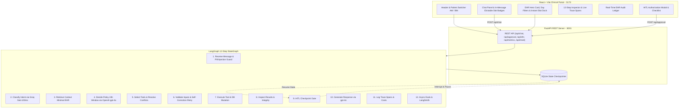

# Implementation Plan & Architectural Spec: NovaHealth LangGraph Healthcare Agent

Completed technical architecture and specifications for the end-to-end 12-step LangGraph healthcare appointment rescheduling and policy enforcement system, paired with the clinical web portal.

---

## 1. System Architecture

---

## 2. Completed Components

### Backend (`agent_system/`)
- **Dual Model Router & Circuit Breaker**: Groq (`llama-3.3-70b-versatile`) for Steps 2 & 6; OpenAI (`gpt-4o`) for Steps 4 & 10; automatic failover to `gpt-4o-mini` on Groq 429/timeouts.
- **Dynamic Feedback Self-Correction Loop**: Conditional routing `Step 6 ➔ Step 5` on Pydantic schema validation failures with structured diagnostics (`field`, `input`, `msg`, `type`), bounded to `MAX_RETRIES = 2`.
- **Deterministic 24-Hour Policy Engine**: Blocks reschedule or cancellation requests for appointments occurring within 24 hours (e.g. `APT-202`).
- **Same-Slot Reschedule Interception (`POLICY_SAME_SLOT`)**: Intercepts requests attempting to reschedule to the active appointment's already booked date/time, short-circuiting tools and HITL gates to provide a clear confirmation notice.
- **Flexible Natural Slot Normalizer & Repair Engine**: Parses ISO, 12h/24h timestamps, AM/PM, natural dates (`09-24 17:00:00`, `Sep 24 at 2pm`), and repairs malformed inputs.
- **Conflict Handling**: Politely explains physician unavailability and offers open slots.
- **Persistent HITL Gate**: LangGraph `interrupt_before=["human_approval_node"]` with `SqliteSaver` (`server_checkpoints.db`).
- **Real-Time Streaming**: Server-Sent Events (SSE) endpoints (`/api/chat/stream`, `/api/approval/stream`) streaming step execution and progress.
- **Observability & Telemetry**: Dynamic token tracking, cost computation in USD, `self_correction_recovery_rate`, and LangSmith integration.

### Frontend (`frontend/`)
- **Design System**: Clinical cyber-clean dark mode in Vanilla CSS with glassmorphism and Google Fonts (`Outfit`, `Inter`, `JetBrains Mono`).
- **Multi-Tenant Profile Isolation**: Independent state trees for `patientMessages`, `patientThreads`, `patientDrafts`, `patientTraces`, and `patientPendingApproval` keyed by `patientId` (`P101` vs `P102`). Toggling profiles never leaks messages, and each session runs against its own LangGraph checkpoint thread.
- **Segmented Portal Tabs**: Toggle between **Appointment & Open Slots**, **12-Step Loop & Telemetry** (with interactive step inspector and `🔄 Loop` badge), and **EHR Audit Trail Ledger**.
- **Hero Appointment Card**: Relative notice indicator, clinic room location, and expandable **Visit Prep Notes**.
- **Day Filter Bar & Slot Dock**: Filter by day and use **"⚡ Instant Reschedule ➔"** for 1-click booking without typing.
- **Interactive In-Message Slots**: Assistant slot suggestions render as clickable buttons.
- **Web Audio Feedback & Toasts**: Synthesized audio feedback for clicks, success chimes, and HITL alerts (with mute toggle), plus floating toasts.

---

## 3. Verification & Test Coverage

- **50 Pytest Tests Passing** (`PYTHONPATH=agent_system python3 -m pytest agent_system/tests -v`):
  - 12 Production Edge Cases (`test_edge_cases.py`)
  - 5 Pydantic Self-Correction Loop Tests (`test_self_correction.py`)
  - 4 Streaming & Thread History Tests (`test_streaming.py`)
  - 4 Deterministic Policy Tests (`test_policies.py`)
  - 4 Security & Guardrail Tests (`test_guardrails.py`)
  - 3 Router & Circuit Breaker Tests (`test_router_circuit.py`)
  - 13 End-to-End StateGraph Tests (`test_state_graph.py`)
  - 5 Tool Contract Tests (`test_tools.py`)
- **Production Vite Build**: Clean build in **136ms**.
- **Live Multi-Turn Verification**: Validated same-slot reschedule notice, HITL authorization, self-correction repair loops, and streaming updates.
